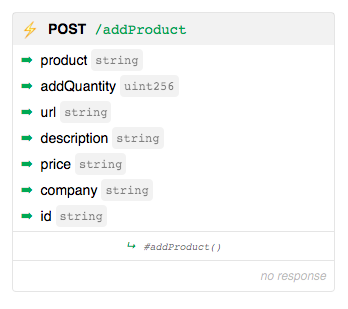
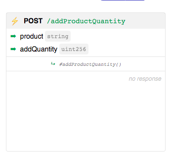
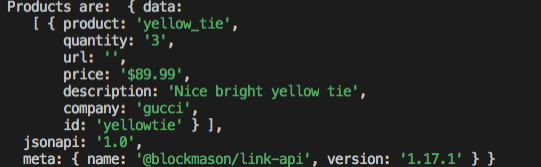

# Interact with Smart Contract functions to build Microservices
Goal: Use Link APIs to interact with the previously deployed 'purchasing' and custom token smart contracts. 

### Install Link JavaScript SDK

Recall that on the Link homepage, clicking on the gear icon next to `Code/API` toggles the `client_id` and `client_secret` at the bottom of the code editor screen.


and the corresponding API endpoints:


We will use these credentials to interact with the API endpoints using the Link JavaScript SDK.

The Link JavaScript SDK is available using Yarn or NPM (https://www.npmjs.com/package/@blockmason/link-sdk).

We will also use a basic node script to interact with the APIs. To use the Link JavaScript SDK with node, we also need to install the `node-fetch` library. 

> From the root project folder, run:
```
npm install @blockmason/link-sdk

npm install node-fetch
```
### Interact with the Link APIs
> Open `Tutorial_3/demo/purchasing-demo-script-template.js`. Here we have a template script file with several functions that need to be completed. We will go through the process of adding code for a few of these functions. 

First, let us look at the dependencies and Link SDK initialization:
```
const fetch = require('node-fetch');
const { link } = require('@blockmason/link-sdk');

// Authenticate with Link API
const project = link({
    clientId: '',
    clientSecret: ''
  }, {
    fetch
});
```
The first two lines import our `node-fetch` and `link-sdk` libraries as `fetch` and `link` objects respectively.

We then instantiate the `link` object by passing in the `clientId` and `clientSecret` which we get from Link as shown above. 

> Enter in your Link `clientId` and `clientSecret` found at the bottom of the code editor or API endpoint screen in Link. 

Note - because we are using *node* here, we pass in the `fetch` object into `link` to help manage our http requests. 

Now our `project` object is correctly initialized and connected with Link to make `GET` and `POST` requests with simply `project.get(..)` and `project.post(..)` respectively!

**Remember: All calls to the API endpoints must be async!**

#### addProduct()
```
async function addProduct(product, addQuantity, url, description, price, company, id) {
    //TODO
}
```
Let us take a look at the `POST /addProduct` API endpoint in Link:



This tells us all the request parameters we need to send in the POST request and their data type. 

Our code might look something like this:
```
async function addProduct(product, addQuantity, url, description, price, company, id) {
  const reqBody = {
    "product": product,
    "addQuantity": addQuantity,
    "url": url,
    "description": description,
    "price": price,
    "company": company,
    "id": id
  }
    
  await project.post('/addProduct', reqBody);
}
```

If you are not familiar with JavaScript's `async/await` syntax, please take a look at https://developer.mozilla.org/en-US/docs/Web/JavaScript/Reference/Statements/async_function

#### addProductQuantity()
```
async function addProductQuantity(product, quantity) {
    //TODO
}
```
Recall that our smart contract code for adding quantity is:
```
function addProductQuantity(string memory product, uint addQuantity) public {
  require(productList[product].isSet);
  productList[product].quantity += addQuantity;
}
```

And the Link API endpoint is:



This should be pretty straightforward but **there is one subtlety that we must factor in!** The Link API documentation tells us that no response is provide. While this is true for the smart contract function not returning anything, we will still get a response at the `http` layer. This is important because **if the `require(productList[product].isSet)` requirement fails, we will only see a error sent at the `http` level!**

So our code might look something like this:
```
async function addProductQuantity(product, quantity) {
  const reqBody = {
    "product": product,
    "addQuantity": quantity
  }
  
  const response = await project.post('/addProductQuantity', reqBody);
  console.log('POST /addProductQuantity called with request data ', reqBody);
  if (response.errors) {
    console.log('Error with adding quantity of ', quantity, '. Check that product exists!');
  }
}
```
Now if the `http` response object contains an error, it would be because the `require(...)` statement failed which helps provide context for the reason for the error.

#### purchaseProduct()
```
async function purchaseProduct(product) {
    //TODO 
}
```

Similar to `#addProductQuantity()`above, the smart contract code contains a `require(..)` statement:
```
function purchaseProduct(string memory product, address purchaser) public {
  require(productList[product].purchasers.length < productList[product].quantity); 
  productList[product].purchasers.push(purchaser);
}
```

For the purpose of this demo script, we will fix the purchasers wallet address to `0xaFf485B0dd5D2c2851FDf374D488379F75403663` (it can be any Ethereum wallet address).

So our code might look something like this:
```
async function purchaseProduct(product) {
  const reqBody = {
    "product": product,
    "purchaser": "0xaFf485B0dd5D2c2851FDf374D488379F75403663"
  }
  
  const response = await project.post('/purchaseProduct', reqBody);
  console.log('POST /purchaseProduct called with request data ', reqBody);
  if (response.errors) {
    console.log('Error with purchasing product. Check that product and sufficient quantity exists');
  }
}
```
> Go ahead and complete the `#getProductDetails` function, which will call the `GET /productList` endpoint.

> Go ahead and complete the `#getProducts()` function, which will call the `GET /events/Product`. Note - since these are events, a **list** object is returned. 

> See the complete code in `Tutorial_3/demo/purchasing-demo-script.js`

#### Running the script
At the bottom, of the script file, we create a *test product* and then below that, we make our function calls. 

> Uncomment the function you want to call, and then simply run: `node <filename>` from your Terminal/Command Prompt.

For example, if you: 
* Execute the `#addProduct(..)` function
* Uncomment the previous function and execute the `#getProducts()` function

you will see an output like:



**Congrats! You have succesfully interacted with your smart contract using web APIs through Link!**

In the next tutorial, we will create microservices, which will be short, concise javascript files running one specific service, which will then be used by our front-end ecommerce marketplace app. 
