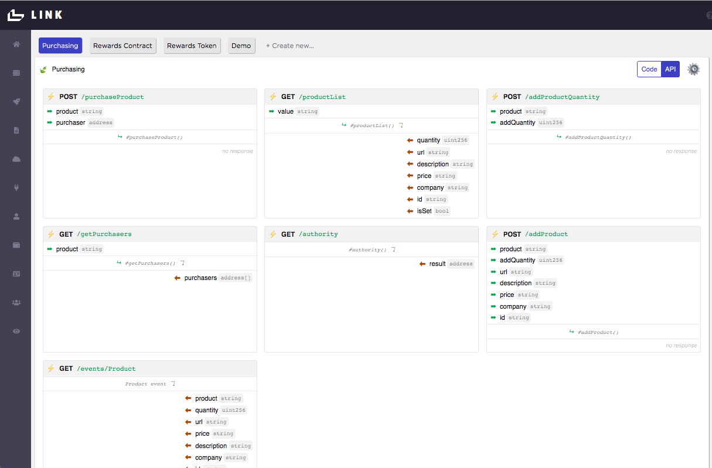

# Interact with Smart Contract functions to build Microservices
Goal: Use Link APIs to interact with the previously deployed 'purchasing' and custom token smart contracts. 

### Install Link JavaScript SDK

Recall that on the Link homepage, clicking on the gear icon next to `Code/API` toggles the `client_id` and `client_secret` at the bottom of the code editor screen.


and the corresponding API endpoints:



We will use these credentials to interact with the API endpoints using the Link JavaScript SDK.

The Link JavaScript SDK is available using Yarn or NPM (https://www.npmjs.com/package/@blockmason/link-sdk).

We will also use a basic node script to interact with the APIs. To use the Link JavaScript SDK with node, we also need to install the `node-fetch` library. 

> From the root project folder, run:
```
npm install @blockmason/link-sdk

npm install node-fetch
```
### Interact with the Link APIs

Interacting with your smart contracts through the Link APIs is easy thanks to the Blockmason Link SDK installed previously.

Let's break down the components of making a Link API request through the SDK.

Here is an example:

```
    getProducts: async function () {
        productList = await purchaseMicroservice.get('/events/Product');
        return productList.data
    }
```