# Run Your Ecommerce Marketplace App
Goal: Bringing all the microservices together in one application and getting it running.

## Let's look at an overview of what we have built so far

The application can be broken down into 3 basic sections: Product, Currency, and Comments. And a fourth being the front-end.

* **The Payments Service**: This controls the transfer of funds from a buyer to a seller upon purchase of a product. The Smart Contract used to create this service creates the tokens that represent value, distributes those tokens, and manages the transfer of tokens on behalf of the users. These transactions are then recorded on the blockchain and can be confirmed by the appropriate blockchain explorer.

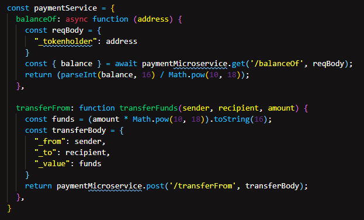

* **The Comments Service**: This allows customers to leave reviews and comments on particular products. These comments are then recorded to the appropriate blockchain. The Smart Contract used to create this service records the comment text and the product id associated with the comment. The contract can then recall all the past comments for each product.

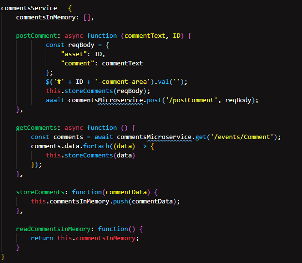

* **The Purchase Service**: This is a basic product management system. It controls the creation of new products including the details of the product such as product name, quantity, description, price etc. it then stores that data. This contract also manages product stock, and contains a ledger of product purchase history including the customers who purchased the product.

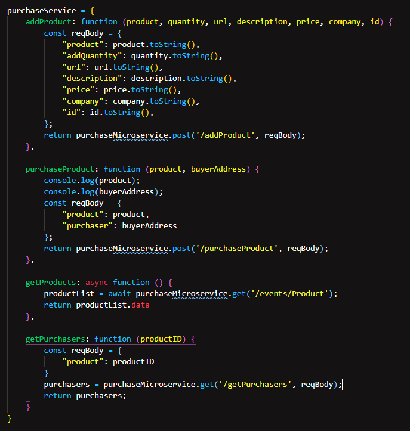

Once we have our front-end set up, we can pull each service together in the ```index.js``` file.

## Front-End Breakdown

Instead of breaking down the entire ```index.html``` and ```index.js``` files let's take a look at some of the general concepts behind these files and the way they interact.

The core piece of the ```index.html``` file that we interact with is the product template. Inside the product template we create and store most of our data. The bulk of the DOM manipulation is achieved through the JavaScript library Jquery.

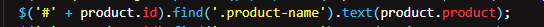

on the ```index.js``` side whenever you see ```$('something in here')``` that is using the Jquery library.

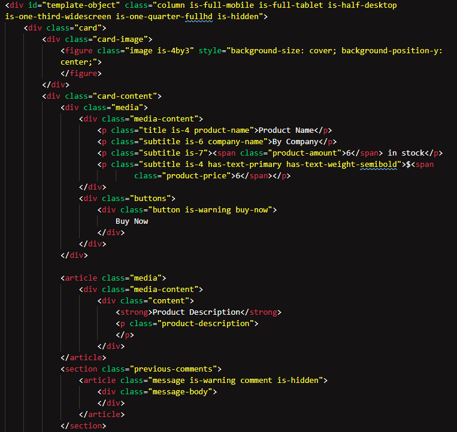

Now stepping inside the ```index.js``` file there are several key actions we want to respond to when a user is interacting with our application on the front-end.

The first is logging in. When a user enters their credentials at the top of the page it maps their username to a specific wallet in a series of wallet addresses. This wallet will then be associated with any interactions the user has such as purchasing a product.

The next key action is purchasing a product. When a user clicks the 'Buy Now' button on a product card, a function is called to the Payment service and Purchase service. If the payment is successful (if the user has enough money to buy the product) and if their is enough stock of that particular item then the purchase is recorded, and the funds are transferred. The ```index.js``` file gets the appropriate id of the product a customer intends to purchase from the data and id attributes associated with the DOM elements created during from the product template. Which brings us to our next component, printing each product and creating new products.

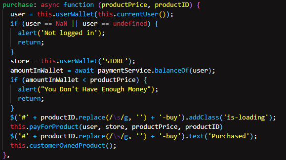

Products are generated on the front-end by retrieving an array of product data that has been stored on the blockchain. The appropriate data is then distributed on a unique copy of the product template including images, description, and price, and then displayed on the page as a product card. More products can be added by using filling in the "add new product" form. Once submitted the data in the form is sent through the Purchase service to the blockchain to be added to the list of products available.

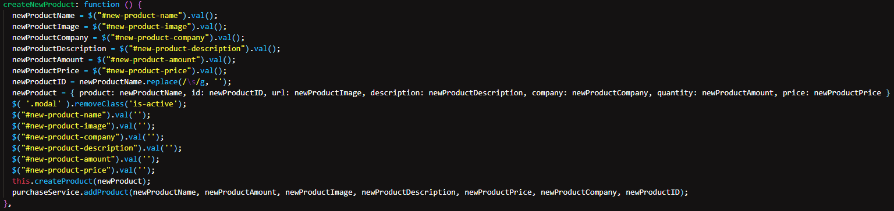

Finally customers can leave comments and reviews on specific products. When a comment is submitted, in the ```index.js``` file using Jquery we can retrieve the text that has been submitted, and the id of the product that the comment is associated with. This data is then sent using the Comments service to the Link API and finally recorded on the blockchain. All the appropriate comments are retrieved from the blockchain when the page loads and displayed.

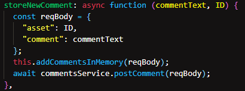

## Application Overview

Now that we have the front-end and microservices figured out let's take a look at how they all tie together. It's pretty easy to follow: Each microservice acts independently from the other services and from the front-end. This means that the service can be transported to other applications with ease (say if you wanted to build a mobile app instead). The ```index.js``` file then acts as the glue that ties the interactions of each microservice and the front-end HTML together. This keeps the front-end independent from each individual component, and will make it easier to add new features in the future.

Each microservice also interacts with a blockchain network via Link as we have seen in past tutorials. 

*The flow of interactions looks something like this:*

```index.html``` <-----> ```index.js``` <-----> Payment Service <-----> Link <-----> Blockchain Network

```index.html``` <-----> ```index.js``` <-----> Purchase Service <-----> Link <-----> Blockchain Network

```index.html``` <-----> ```index.js``` <-----> Comment Service <-----> Link <-----> Blockchain Network

## Let's get it running!

The last thing to do is get our application running.

* Make sure you have installed Parcel JS from https://parceljs.org/getting_started.html

> Now open up your terminal and run the command ```npm start``` or alternatively ```parcel src/index.html```.
This should start up our parcel server and run the application at ```localhost``` port ```1234```, and thats it! If everything is up and running, you should see the following front-end:

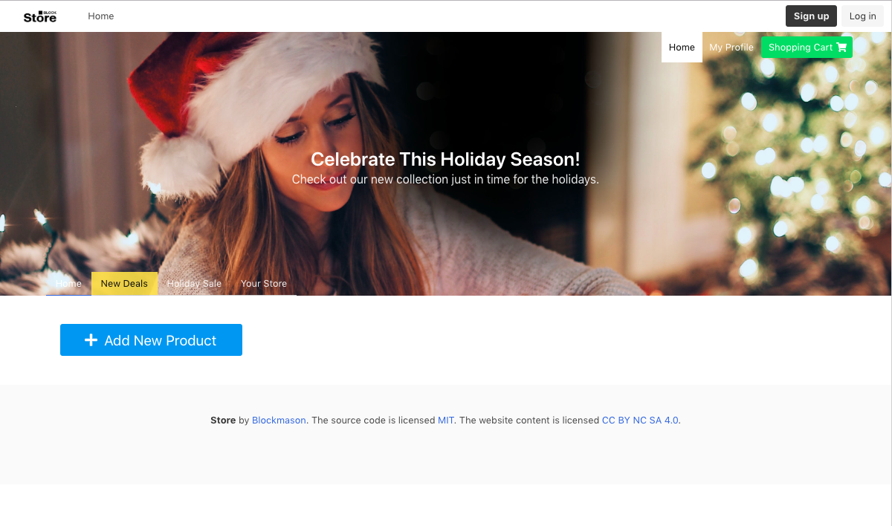

> Great! Now let us add a new product and record it on the blockchain. The `Add New Product` modal looks like:

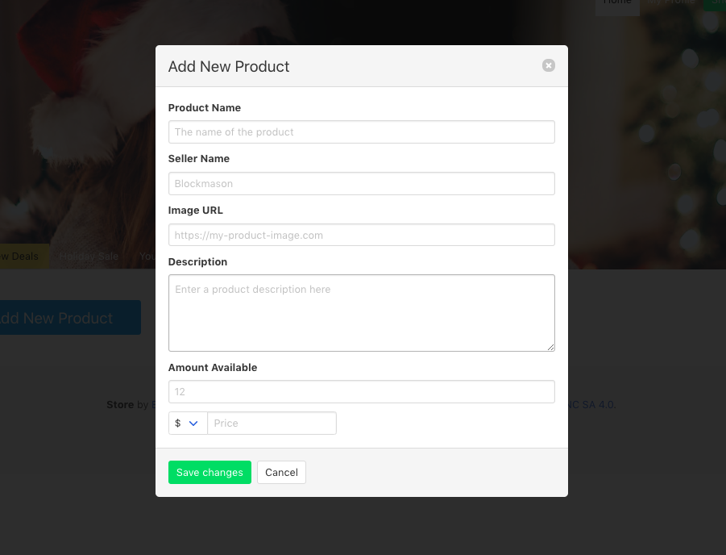

> Let us add a new soccer ball with this image URL from [Unsplash](https://images.unsplash.com/photo-1567117632960-56e34a4c2456?ixlib=rb-1.2.1&ixid=eyJhcHBfaWQiOjEyMDd9&auto=format&fit=crop&w=1050&q=80). Fill in the modal as follows:


And see your new product added to the marketplace!

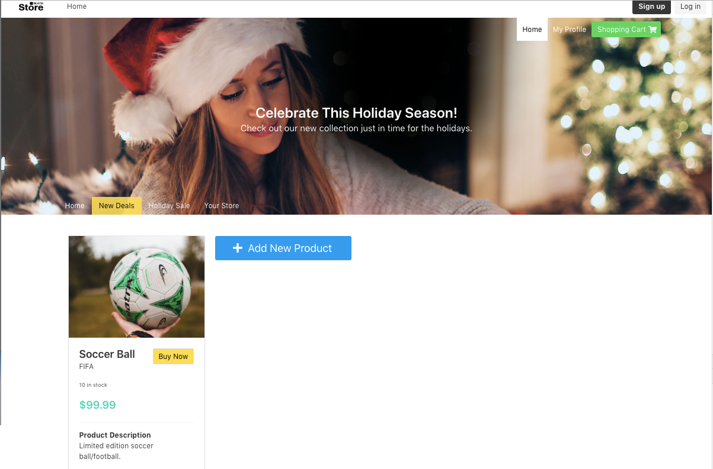

> Refresh the website to ensure your product is being correctly retrieved from the blockchain!

To purchase a product, you need to 'log in'. What this really means, is using one of the following names we have mapped to accounts in `index.js` in the log in field:

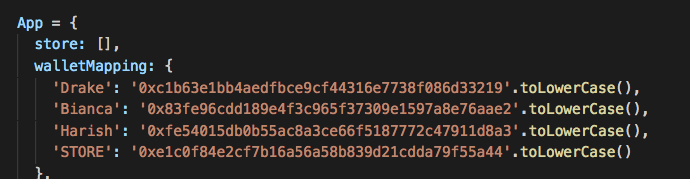

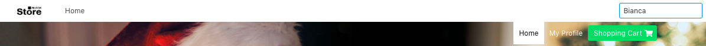

> Go ahead and add products to this marketplace, buy products, and add comments - all of these microservices powered by blockchains!

#### Congratulations you are done!